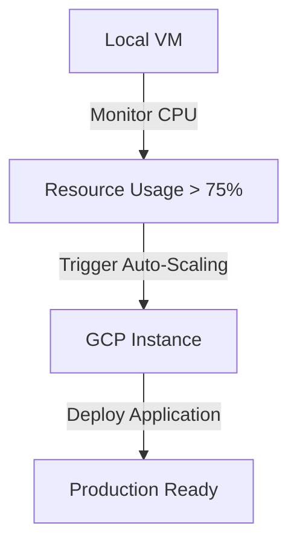

# B22CS022_VCC_Asgn03
# Auto-Scaling Local VM to GCP

## 📌 Objective
This project demonstrates how to create a local VM, monitor its resource usage, and auto-scale to Google Cloud Platform (GCP) when CPU usage exceeds 75%.

## 🚀 Features
- Local VM setup using **Ubuntu (VirtualBox/VMware)**
- Resource monitoring with **htop & Bash scripts**
- Auto-scaling to **GCP Compute Engine**
- Secure file migration using **SCP & SSH**
- Stress testing with the **stress** command

## 🛠️ Implementation Steps

### 1️⃣ Setup Local Virtual Machine
1. Install **VirtualBox** or **VMware**.
2. Download & install **Ubuntu 22.04 LTS**.
3. Update system packages:
   ```sh
   sudo apt update && sudo apt upgrade -y
   ```
4. Install monitoring tools:
   ```sh
   sudo apt install htop bc
   ```

### 2️⃣ Resource Monitoring Script
Create a script `monitor_resources.sh` to monitor CPU and memory usage:
```sh
#!/bin/bash
CPU_USAGE=$(top -bn1 | grep "Cpu(s)" | awk '{print 100 - $8}')
MEMORY_USAGE=$(free | awk '/Mem/{printf "%.2f", $3/$2 * 100}')

echo "CPU Usage: $CPU_USAGE%"
echo "Memory Usage: $MEMORY_USAGE%"

if (( $(echo "$CPU_USAGE > 75" | bc -l) )); then
    echo "CPU usage exceeded 75%. Triggering auto-scaling..."
    ./migrate_to_gcp.sh
fi
```
Make the script executable:
```sh
chmod +x monitor_resources.sh
```

### 3️⃣ Configure Google Cloud Auto-Scaling
1. **Create a new project** in GCP.
2. **Enable Compute Engine API**:
   - Go to `API & Services > Library`.
   - Search for **Compute Engine API** and enable it.
3. **Download the JSON Key File**:
   - Navigate to `IAM & Admin > Service Accounts`.
   - Create a service account and generate a **JSON key**.
4. **Install & Authenticate GCloud SDK**:
   ```sh
   sudo apt install google-cloud-sdk -y
   gcloud auth activate-service-account --key-file=/path/to/your-key-file.json
   ```

### 4️⃣ Automate Migration to GCP
Create `migrate_to_gcp.sh` script:
```sh
#!/bin/bash
INSTANCE_NAME="auto-scale-instance"
ZONE="us-central1-a"

echo "Creating a new instance on GCP..."
gcloud compute instances create $INSTANCE_NAME --zone=$ZONE --machine-type=e2-medium --image-family=ubuntu-2204-lts --image-project=ubuntu-os-cloud

echo "Transferring files..."
scp -i ~/.ssh/id_rsa -r /local/path user@$INSTANCE_NAME:/remote/path
```
Make it executable:
```sh
chmod +x migrate_to_gcp.sh
```

### 5️⃣ Stress Testing
Use `stress` to simulate high CPU usage:
```sh
sudo apt install stress -y
stress --cpu 4 --timeout 60s
```
Run monitoring script:
```sh
./monitor_resources.sh
```

## 📊 Architecture Diagram



## 📂 Repository Structure
```
📂 auto-scaling-vm
├── monitor_resources.sh
├── migrate_to_gcp.sh
├── setup_gcp.md
├── stress_test.md
└── README.md
```


---
Developed by **Gubbala Bhargavi**
